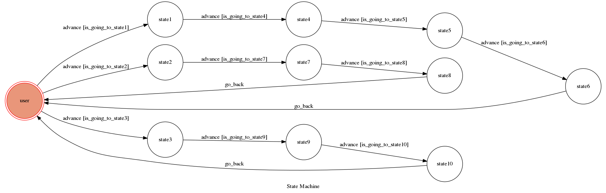
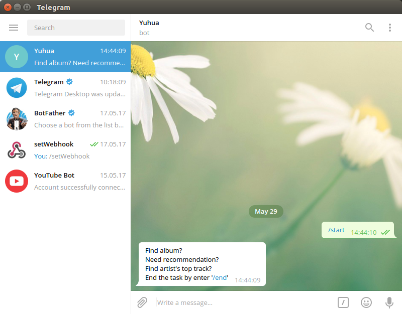
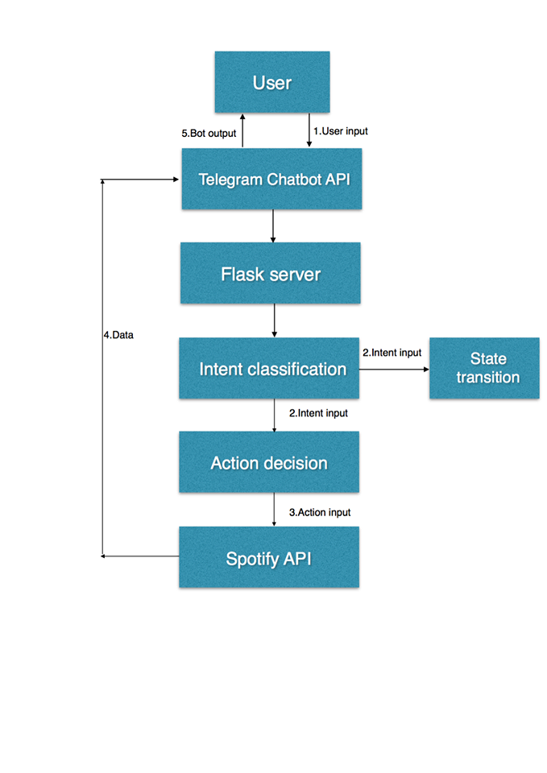
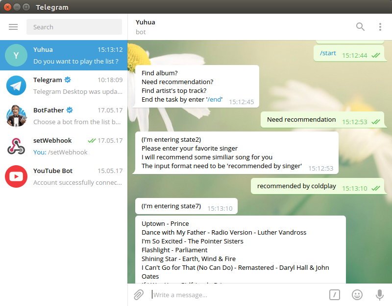
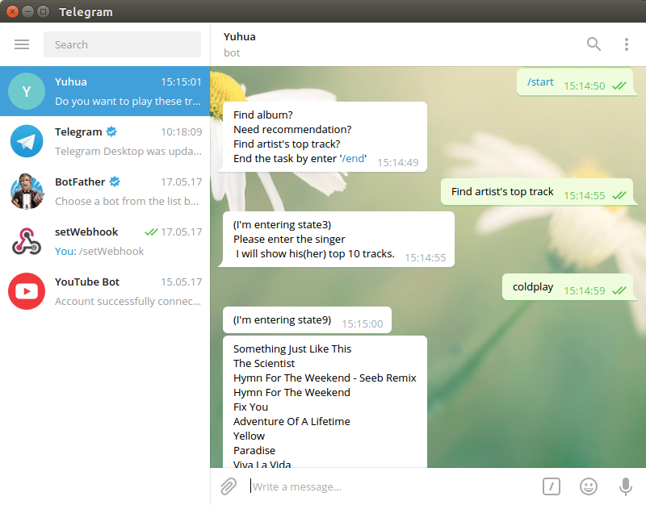

# Toc-Project2017
Final project

A telegram bot based on a finite state machine

## Setup

### Prerequisite
* Python 3
* spotipy 
* api.ai
* telegram
#### Install Dependency
```sh
pip install -r requirements.txt
```
### Webhook URL
這次作業我沒有使用助教給的ngrok，因為實驗室剛好需要買一個Domain name來做chatbot的接口(大多數的Chat API都需要),故我直接買了一個Domain name給實驗室的IP, 來當作Webhook的URL.
#### Run the server
```sh
python demo.py
```
## Finite State Machine


## Usage 


初始State都是在'user'
這次作業我設計了三個功能, 選擇第一項會進入State1 , 第二項會進入到State2, 第三項會進入到State3.

1. 透過歌手查詢專輯, 輸入歌手會進入State4, Bot會顯示這位歌手歷年專輯，在輸入想要聆聽的專輯進入state5, Bot會顯示這張專輯裡的每一首歌並且詢問使用者是否要聆聽這張專輯, 目前預設是使用者都會打 "yes"並且進入state6.

2. 透過喜愛的歌手推薦相關歌曲, 輸入歌手會進到State7, Bot則會顯示相關歌曲並且詢問是否要聆聽這份list, 目前預設是使用者都會打 "yes"並且進入state8.

3. 透過歌手查詢該歌手Top 10 tracks, 輸入歌手會進到State9, Bot會顯示出Tracks並且詢問是否要聆聽這份list, 目前預設是使用者都會打 "yes"並且進入state10.

到達每個分支最後一個State輸入"/end"就會回到User state.
輸入"/check_state" 則能查到目前所在狀態.

## System description 


User input 首先會透過Intent classification來判斷說這句話的Intent 
* Ex: 在我的Bot中"ok","yes"這兩句判斷會是一樣的意思,"Show recommendation","Need recommendation"也是一樣
分析出來的Intent會傳至Machine中做State transition, 並且也傳至Action decision去根據User所需要的資料來決定Action, Action會透過Spotify API從Spotify 裡面撈資料, 回傳給使用者.
### Intent classification
* Intent判斷的部份是透過api.ai, api.ai是一款適合Dialogue Systems的Intent classification Agent，先設定好Intent，Entity並且指定他回傳的資料, 就可以很輕鬆的完成Intent classification.其中裡面還能繼續上傳檔案作Training, 讓Agent更加聰明能認出以前沒看過的字並且增加判斷正確的機率 ,原先一開始是想透過Slot filling配合RNN自己Train出一個NN, 但發現時間及Training data 不夠, 故選用這個方便的API.

### Spotify API
* Spotify的部份是因為我有訂閱會員, 所以可以使用它的Application開發模式, 透過這個API我能輕鬆取得專輯, 歌手, 歌曲的資料, 不過每次撈資料都要連過去撈, 這樣還是會花費一點時間, 做這種任務取向的Bot還是使用一個已存取Entity之間關係的資料庫配合Slot filling是最佳解.


## Input Example 
 



